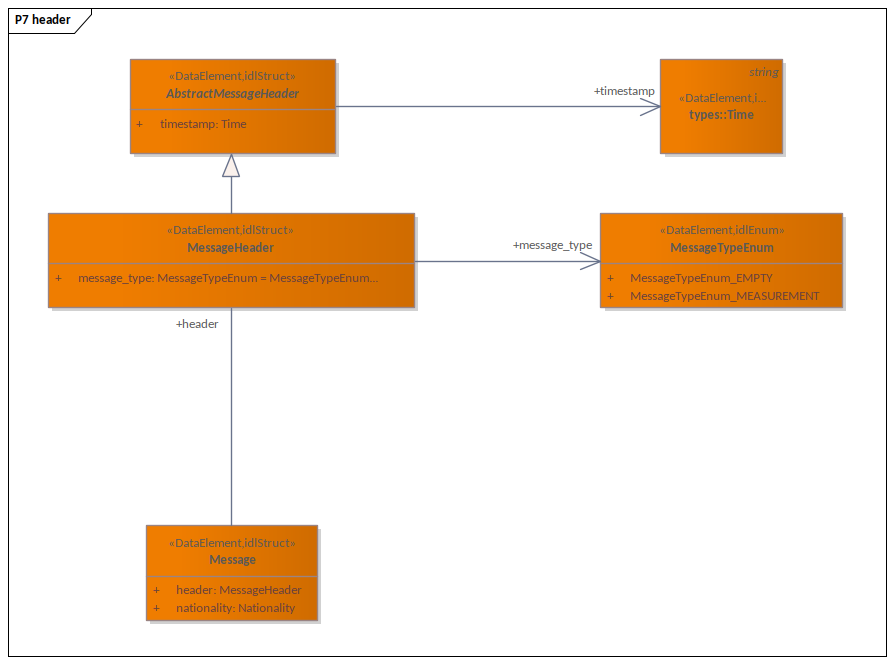

# Model

Notes on model elements in P7 diagrams.

- All P7 packages need to be stereotype `DataModel`
- All P7 objects need to be stereotyped with `DataElement`
- All P7 objects need to be stereotype with one of: `idlUnion`, `idlEnum`, `idlStruct`, `idlTypedef`

## Napespaces

- We can have nampespaces/packages
- those can be nested
- package with classes cannot have other packages (so only packages without classes can have subpackages)

## Naming

All modelled elements must be named with alpha-numeric characters and underscores.
Naming conventions follow Python ones (https://peps.python.org/pep-0008/):

- PascalCase for classees - `FirstClass`
- snake_case for packages - `first_package`
- snake_case for variables/attributes - `first_value`
- Enum types suffixed with Enum - `FooEnum_FIRST_VALUE`

## Type definitions

- use `idlTypedef` (IDL) and `DataElement` (NAF) stereotypes
- have no fields
- have a primitive type as parent

  - `string`
  - `float`
  - `double`
  - `integer`
  - `bool`

- can have various tags
- one of the tags can be `unit` - with short string, prefer [SI](https://www.bipm.org/en/measurement-units), this is just informative:

  - "m" - meters
  - "s" - seconds
  - "Hz" - hertz
  - "%" - percent

## Enumerations

- use `idlEnum` (IDL) and `DataElement` (NAF) stereotypes
- its name is always suffixed by `Enum`, like `MeasurementTypeEnum`
- all its members are prefixed by names, `MeasurementTypeEnum_TEMPERATURE` (because in some languages enums are global)

## Structures

- use `idlStruct` (IDL) and `DataElement` (NAF) stereotypes
- use generalization for inheritance

### Fields

- fields have a name and type (that should match actual type)
- should be public (this is interface what we design, not class)
- fields can have multiplicity [from..to]

  - [0..*] - means not limited sequence/list
  - [0..5] - means sequence/list of maximum 5 elements
  - [1..5] - means sequence/list of minimum 1 element and maximum 5 elements
  - [1..*] - means sequence/list of minimum 1 element and no upper bound

- fields can have `<<optional>>` stereotype

  - not all `<<optiona>>` and multiplicity make sense, not in all languages
  - all sequences with no lower bound ([0..*] & [0..5]) de-facto optional (but no list is different than empty list)

- all list/sequence need to have `is_collection` flag set to `True`

- actual type is discovered via association

  - from structure to field
  - direction is from source to destination
  - with TARGET set to name of field


```c
struct Store {
    core::data::types::Identifier one;
    sequence<core::data::types::Identifier> sequence;
    @optional
    core::data::types::Identifier optional_one;
    @ext::maxItems(5)
    sequence<core::data::types::Identifier, 5> sequence_upper_bound;
    @ext::minItems(1)
    sequence<core::data::types::Identifier> sequence_lower_bound;
    @ext::minItems(1)
    @ext::maxItems(5)
    sequence<core::data::types::Identifier, 5> sequence_bound;
    @optional
    sequence<core::data::types::Identifier> optional_sequence;
    @ext::maxItems(5)
    @optional
    sequence<core::data::types::Identifier, 5> optional_sequence_upper_bound;
};
```

## Unions

Union is a class that has multiple exclusive fields.

- use `idlUnion` (IDL) and `DataElement` (NAF) stereotypes
- it has association to enumeration, that assotiation has `<<union>>` stereotype

  - assuming that union name is `Measurement` the enumeration name is `MeasurementTypeEnum`
  - for each union members (fields), enumeration has an entry `MeasurementTypeEnum_FIELD_NAME_CAPITALIZED`
  - enumeration can have more entries


```c
enum IdentifierOrNameTypeEnum {
    @value(3) IdentifierOrNameTypeEnum_NAME,
    @value(1) IdentifierOrNameTypeEnum_IDENTIFIER
};
union IdentifierOrName switch (core::data::IdentifierOrNameTypeEnum) {
    case core::data::IdentifierOrNameTypeEnum_IDENTIFIER:
        core::data::types::Identifier identifier;
    case core::data::IdentifierOrNameTypeEnum_NAME:
        core::data::types::Name name;
};
  ```

Unions are also special when put togethere with `filter_stereotypes` option. This union normally get generated like this:


```c

enum MeasurementTypeEnum {
    @value(1) MeasurementTypeEnum_TEMPERATURE_MEASUREMENT,
    @value(0) MeasurementTypeEnum_STRING
};
union Measurement switch (core::data::MeasurementTypeEnum) {
    case core::data::MeasurementTypeEnum_TEMPERATURE_MEASUREMENT:
        core::data::types::TemperatureMeasurement temperature_measurement;
    case core::data::MeasurementTypeEnum_STRING:
        string string;
};

sequence<core::data::Measurement, 5> body;
```

Lets assume that `hibw` is filtered out in this case, the whole `Measurement` is gone and `TemperatureMeasurement` is used directly instead.
This is done to reduce nesting of generated outputs.

```c
sequence<core::data::types::TemperatureMeasurement, 5> body;
```

## Abstract

Classes can be abstract. Those inheriting those will take fields, but abstract class will not show in output.



```c
struct MessageHeader {
    core::common::types::Time timestamp;
    @default(core::message::MessageTypeEnum_MEASUREMENT)
    core::message::MessageTypeEnum message_type;
};
```


## mapping

| Model name            | IDL name         | custom | comment                                                                            |
| --------------------- | ---------------- | ------ | ---------------------------------------------------------------------------------- |
| maximum               | max              | false  | inclusive maximum                                                                  |
| exclusiveMaximum      | exclusiveMaximum | true   |                                                                                    |
| minimum               | min              | false  | inclusive minimum                                                                  |
| exclusiveMinimum      | exclusiveMinimum | true   |                                                                                    |
| pattern               | pattern          | true   | for compatibility patterns should use the most universal syntax (check below)      |
| interface             | interface        | true   | for messages/interface definitinons (top level)                                    |
| maxItems              | maxItems         | true   |                                                                                    |
| minItems              | minItems         | true   |                                                                                    |
| isFinalSpecialization | final            |        |                                                                                    |
|                       | appendable       |        |                                                                                    |
|                       | mutable          |        |                                                                                    |
| unit                  | unit             | false  | unit, prefer https://www.bipm.org/en/measurement-units as stated in IDL definition |
|                       | value            |        | taken from initial value of attribute                                              |

### Regular expression syntax
IDL standard does not specify any particular regular expression language for pattern model.

We aim for compatibility with multiple regex engines, primarily:
 - PCRE implementations
    - Python's `re` and Pydantic V1
    - Rust regex crate (Pydantic V2)
 - W3C XML Schema (used in XSD)
 - ECMA-262 (used in JSON Schema)

Those engines differ in syntax and functionality, so a simple syntax subset should be used.

Their syntax overlap but none is a strict subset of the others, so we constrain ourselves to the small intersection described below.

#### Syntax Scope

Use only constructs that exist in all three grammars.

| Category          | Allowed                       | Disallowed                                                           | Notes                                                                                                                                 |    |                            |
| ----------------- | ----------------------------- | -------------------------------------------------------------------- | ------------------------------------------------------------------------------------------------------------------------------------- | -- | -------------------------- |
| Character classes | `[A-Za-z0-9 _:\-.,]`          | nested/subtracted classes (`[a-z-[f]]`)                              | Escape `-` if not first/last.                                                                                                         |    |                            |
| Quantifiers       | `?`, `+`, `*`, `{m}`, `{m,n}` | reluctant modifiers (`*?`, `+?`, etc.)                               | Specify explicit bounds when possible.                                                                                         |    |                            |
| Grouping          | `( … )`                       | `(?: … )`, lookahead/lookbehind, backreferences                      | Parentheses are non-capturing in XSD; harmless elsewhere.                                                                             |    |                            |
| Alternation       | `A\|B`                         | empty branches (`A\|`)                                                 | Standard alternation only.                                                                                                            |    |                            |
| Anchors           | omit in canonical form        | anchoring that stays in the shared regex                             | XSD implicitly anchors full string; wrap with `^…$` when generating JSON Schema/ECMA/Python expressions.                              |    |                            |
| Escapes           | `\.` `\-`                     | `\d` `\s` `\w` `\n` `\t` `\b` `\p{}` `\i` `\c`                       | Use explicit `[0-9]` etc.                                                                                                             |    |                            |
| Dot               | `.`                           | depends on context                                                   | `.` matches any char in JSON/Python, not newline; in XSD matches any char except line terminators. Avoid if newline handling matters. |    |                            |
| Unicode           | literal characters only       | `\uXXXX`, `\p{...}`                                                  | Encoding must be UTF-8; no property classes.

#### Construction Rules

* Replace shorthand classes:

  * `\d` → `[0-9]`
  * `\w` → `[A-Za-z0-9_]`
  * `\s` → literal spaces if whitespace is fixed (`[ ]`)
* Replace non-capturing groups `(?:...)` → `( ... )`.
* Remove lookaheads/lookbehinds.
* Remove `^` and `$` in the shared pattern; reintroduce them when emitting language-specific expressions that require explicit anchoring.

In principle: avoid every construct requiring backtracking, memory, or zero-width assertion.

#### Automated conversion

There doesn't exist a tool that would convert an arbitrary regex exactly to the desired format. However this process could possibly be simplified using a tool such as [regex-translator](https://github.com/Anadian/regex-translator). You might need to adjust shebang in `node_modules/regex-translator/source/main.js` to match your node installation.

For example:
```sh
echo '^((?:(\d{4}-\d{2}-\d{2})T(\d{2}:\d{2}:\d{2}(?:\.\d+)?))(Z|[\+-]\d{2}:\d{2}))$' | tee re.txt > /dev/null

npx regex-translator -F pcre -I re.txt -T ecma -o
```

This should output
```re
^((?:([0-9]{4}-[0-9]{2}-[0-9]{2})T([0-9]{2}:[0-9]{2}:[0-9]{2}(?:\.[0-9]+)?))(Z|[\+-][0-9]{2}:[0-9]{2}))$\n
```

After removing anchors, non capturing groups and `\n`:

```re
((([0-9]{4}-[0-9]{2}-[0-9]{2})T([0-9]{2}:[0-9]{2}:[0-9]{2}(\.[0-9]+)?))(Z|[\+-][0-9]{2}:[0-9]{2}))
```

and after removing redundant grouping we get:
```re
([0-9]{4}-[0-9]{2}-[0-9]{2})T([0-9]{2}:[0-9]{2}:[0-9]{2}(\.[0-9]+)?)(Z|[\+-][0-9]{2}:[0-9]{2})
```

which is a valid regular expressions for all listed engines.
